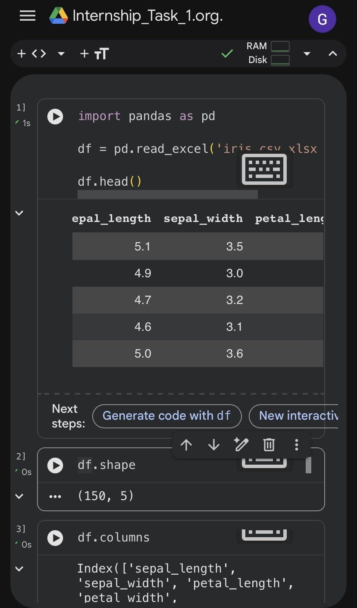
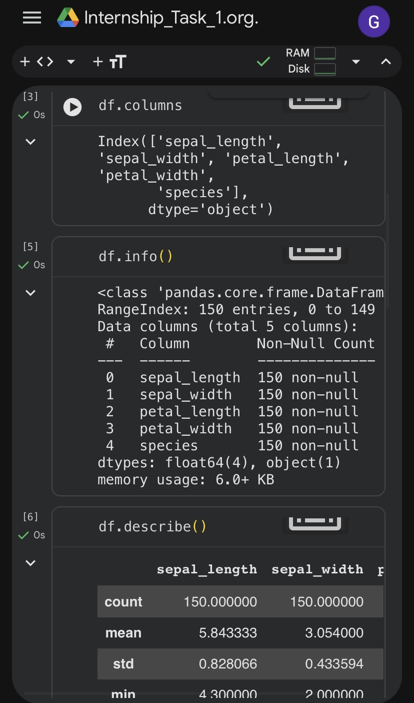
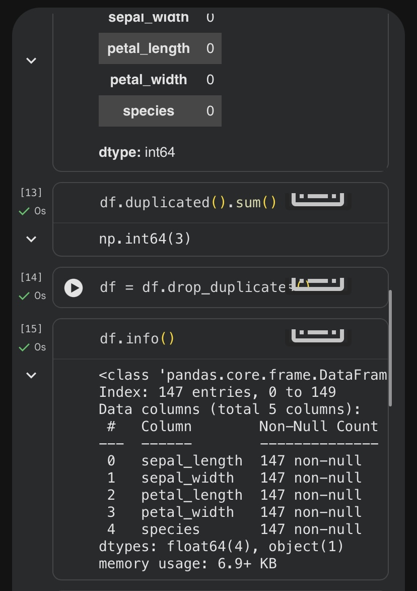
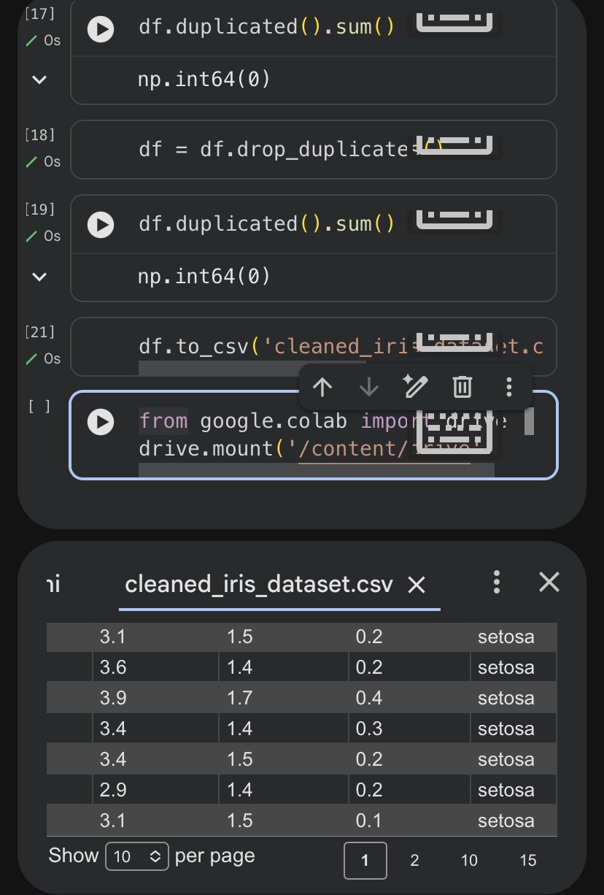

# codveda-datacleaning-task1
# Data Cleaning and Preprocessing using Python and Pandas

## Project Overview

This project demonstrates data cleaning and preprocessing techniques using Python and Pandas in Google Colab. The project includes:

- Dataset loading
- Duplicate checking
- Missing value analysis
- Data preprocessing
- Exporting cleaned datasets


  ## Tools & Libraries Used

- Python
- Pandas
- NumPy
- Google Colab
- GitHub


## Project Structure

```bash
data/           # Raw dataset files
notebooks/      # Google Colab notebooks
outputs/        # Cleaned datasets and results
screenshots/    # Project screenshots
README.md       # Project documentation
```


## Workflow

1. Load dataset
2. Check for duplicates
3. Analyze missing values
4. Clean and preprocess data
5. Export cleaned dataset


## Project Screenshots

### Dataset Preview


### Cleaning Process


### Process Output


### Dashboard View



## Results

- Removed duplicate records
- Handled missing values
- Improved dataset consistency
- Exported cleaned dataset successfully


## Conclusion

This project helped demonstrate practical data cleaning and preprocessing skills using Python and Pandas.

🔗 LinkedIn Update: 
https://www.linkedin.com/posts/glory-anaga_github-anagaglorycodveda-datacleaning-task1-share-7464300292868722689-TRN4/?utm_source=share&utm_medium=member_ios&rcm=ACoAAEzcjzYBKYK0E8nWmeqz2AhiJ-Qde3g72iM
💼 Follow my journey: LinkedIn
